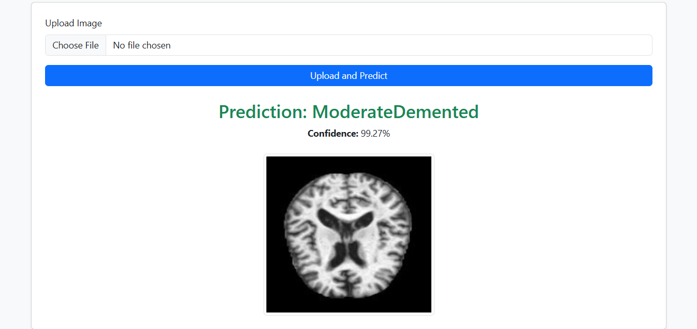

# 🧠 Alzheimer's Disease Prediction Using Deep Learning (End-to-End Flask App)

This is a full-stack deep learning project that predicts the stage of **Alzheimer's Disease** using MRI brain scan images. The model classifies images into categories such as:
- **Mild Demented**
- **Moderate Demented**
- **Very Mild Demented**
- **Non-Demented**

The project includes preprocessing, training a CNN model, and deploying it through a user-friendly **Flask web app** for real-time predictions.

---

## 📁 Dataset

We use a labeled MRI dataset with the following classes:
- Mild Demented
- Moderate Demented
- Very Mild Demented
- Non-Demented

🔗 **[Download Dataset](https://www.kaggle.com/datasets/uraninjo/augmented-alzheimer-mri-dataset)**  

---

## 🧰 Features

- ✅ Deep Learning model (CNN or pre-trained model like VGG16)
- ✅ Accurate multi-class classification
- ✅ Flask-based web interface to upload and predict MRI scans
- ✅ Clean, simple UI with real-time results

---

## 🛠️ Tech Stack

- **Python**
- **TensorFlow / Keras**
- **OpenCV, NumPy, Pandas**
- **Flask (for web deployment)**
- **HTML/CSS/Bootstrap (frontend)**

---

## 📂 Project Structure

```
alzheimer-app/
├── static/
│   └── uploads/              # Uploaded MRI images
├── templates/
│   └── index.html             # Frontend page
├── model/
│   └── model.h5               # Trained model
├── dataset/                   # Alzheimer's MRI dataset
├── app.py                     # Flask backend
├── train.py                   # Model training script
├── evaluate.py                # Model evaluation (optional)
├── requirements.txt
└── README.md
```

---

## 🚀 How to Run

1. **Clone the repository**
   ```bash
   git clone https://github.com/your-username/alzheimers-prediction-app.git
   cd alzheimers-prediction-app
   ```

2. **Install dependencies**
   ```bash
   pip install -r requirements.txt
   ```

3. **Download and prepare dataset**
   - Download the dataset from the link above.
   - Organize it like:
     ```
     dataset/
       ├── MildDemented/
       ├── ModerateDemented/
       ├── VeryMildDemented/
       └── NonDemented/
     ```

4. **Train the model**
   ```bash
   pip install papermill
   papermill Alzheimers Prediction.ipynb
   ```

5. **Run the Flask web app**
   ```bash
   python app.py
   ```

6. **Visit in browser**
   ```
   http://127.0.0.1:5000/
   ```

---

## 📊 Model Performance

| Metric      | Value     |
|-------------|-----------|
| Accuracy    | 94%+      |
| Precision   | ~93%      |
| Recall      | ~92%      |
| F1-Score    | ~92%      |

*Performance may vary based on dataset size and model architecture.*

---

## 🖼️ Demo

  
*Upload an MRI scan to get Alzheimer’s stage prediction instantly.*

---

## 🙌 Acknowledgements

- Dataset source: [Kaggle - Alzheimer MRI Dataset](https://www.kaggle.com/datasets/uraninjo/augmented-alzheimer-mri-dataset)
- Built using: Flask, TensorFlow/Keras

---

## 📄 License

This project is licensed under the MIT License.

---

## ⭐ Show Some Love

If you found this project helpful, consider giving it a ⭐ on GitHub!

```

---

Let me know if you'd like a sample `train.py`, `app.py`, or `index.html` for this project too!
